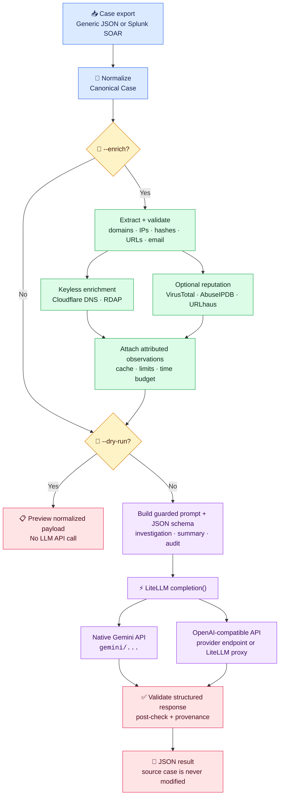

# Standalone Case Analyzer

Soc Analyst is a standalone agentic security-case analyzer. It runs the Case Analysis LLM workflow without Django, PostgreSQL, or the Agentic SOC worker, normalizes exported security-case JSON to a platform-neutral representation, and returns a structured `InvestigationReport` JSON document.



Enrichment calls are separate from the LLM call: `--enrich` sends only extracted
observables to the enabled enrichment providers, then includes their attributed results
in the canonical case. The full analysis payload reaches an LLM only when `--dry-run` is
absent. LiteLLM provides one structured-call interface for direct provider APIs,
OpenAI-compatible gateways, and an optional self-hosted LiteLLM proxy.

For a detailed explanation of the package architecture and execution flow, see the [Case Analyzer code walkthrough](case-analyzer-code.md).

For common questions about evidence handling and generated conclusions, see the [Case Analyzer FAQ](FAQ.md).

For a complete nested-container example and recorded live LLM output, see the [Splunk SOAR case analysis result](examples/splunk-soar-analysis.md). The [Splunk SOAR case summary result](examples/splunk-soar-summary.md) records what `--summary` returns for the same export, with each claim traced back to the evidence it came from. The [full explanation transcript](examples/splunk-soar-explain-case-analysis.txt) records the earlier compatibility command's walkthrough for the same export.

For contrasting cases that exercise evidence-oriented reasoning rather than keyword matching, see the [reasoning examples and recorded comparison](examples/reasoning/README.md).

For examples that use case-specific `--user-input` to perform evidence-quality,
closure-readiness, and response-process reviews, see the
[case-audit guidance examples](examples/user-input-case-audit/README.md).

## Run it

From this directory, create the isolated environment:

```bash
uv sync
```

Inspect normalization without sending data to an LLM:

```bash
uv run case-analyzer examples/generic-case.json --dry-run
```

Validate and enrich observables before analysis:

```bash
uv run case-analyzer examples/splunk-soar.json \
  --format soar \
  --enrich \
  --dry-run \
  --allow-enrichment-in-dry-run
```

`--enrich` performs local syntax validation, queries Cloudflare's keyless DNS-over-HTTPS
resolver for domains, and queries the RDAP registry that holds a public IP address for
its registration data. When `VIRUSTOTAL_API_KEY` is set, it also queries VirusTotal for
domain, public-IP, file-hash, and URL reputation. When `ABUSEIPDB_API_KEY` is set, it
queries AbuseIPDB for public-IP reputation over the preceding 30 days. When
`ABUSE_CH_AUTH_KEY` is set, it queries URLhaus for whole URLs. Keep keys in the ignored
`.env` file; providers without a configured key are simply skipped. Enrichment still contacts providers when it is
combined with `--dry-run`, which otherwise sends no data anywhere, so that combination
requires `--allow-enrichment-in-dry-run` and prints a notice to standard error before
the first request.

Bound the work with `--enrichment-limit` (default `25` unique observables),
`--enrichment-timeout` (default `5` seconds per request), `--enrichment-budget` (default
`60` seconds of wall time for all lookups; `0` disables it),
`--enrichment-concurrency` (default `4` lookups at once), and
`--enrichment-failure-threshold` (default `3` consecutive failures before a provider is
dropped for the rest of the run). Observables that are not looked up because the budget
ran out or a provider was dropped are still listed, with `lookup_status: "skipped"` and
a reason, and the run reports `stopped_early: true`. The budget also caps the timeout of
each request it starts, so a lookup cannot outlive it; a request the budget cuts short is
recorded as `skipped` rather than counted against the provider. The failure threshold
counts lookups that have already failed, and requests in flight are not cancelled, so a
failing provider can receive up to one further set of concurrent lookups. The limit counts unique
observables; configured reputation providers add separately attributed observations, so
a public IP can produce RDAP, VirusTotal, and AbuseIPDB observations, and a URL can
produce URLhaus and VirusTotal observations. When the limit truncates a run, observables
that a provider can actually answer for are kept first, then values whose type the case
declared, then values seen in more places; invalid values are dropped first.

Observables are read from `cef` blocks, from `cef_types` declarations when the ingesting
app provided them, and from recognizable field names elsewhere in the export.
`observable_type` is `domain`, `ip`, `file_hash`, `url`, or `email`.

A URL or email field produces two observables, not one. The value itself is recorded
under its own source path, and its host or domain part is recorded separately with a
`#host` or `#domain` suffix on that path — a whole URL and its host are different
questions with different providers, so neither stands in for the other. A single
malicious path on an otherwise ordinary host is exactly the case where the difference
matters.

URLs are looked up through URLhaus, which indexes whole URLs reported as distributing
malware, and through VirusTotal when its key is configured. URLhaus needs an abuse.ch
Auth-Key (`ABUSE_CH_AUTH_KEY`, from an account at `auth.abuse.ch`); without one, URL
observables are recorded with `lookup_status: "skipped"` and a reason naming the
variable. Read the abuse.ch fair-use terms, and VirusTotal's commercial-use restrictions,
before enabling either in an operational workflow.

Email addresses are recorded but never sent anywhere: no provider configured here answers
for an address. The observable exists so the address appears in the enrichment block with
its source paths, and its domain part is enriched as its own observable. Because they can
never be looked up, email observables — and URL observables when no URL provider is
configured — sort behind everything a provider can answer for, so they never consume an
`--enrichment-limit` slot at the expense of a real lookup.

A URL is normalized only where normalization cannot change which resource is meant: the
scheme and host are lowercased, the host is punycoded, a port the scheme already implies
is dropped, and an empty path becomes `/`. The path, query, and fragment are preserved
exactly as the case wrote them. **Userinfo is removed** — a URL carrying
`user:password@` would otherwise send that credential to a third-party API and write it
to the on-disk cache in the clear. It is removed from `unicode_values` and from the
recorded value of an *invalid* URL as well, since both are saved in the report and sent
to the model; an `@` inside a query string is not treated as userinfo. The original text
stays reachable through `source_paths` — which means a case export that embeds a
credential still carries it into the model payload under `source_data`. Only `http`, `https`, and `ftp` URLs are treated as valid; anything else
is recorded as invalid rather than sent to a provider that cannot answer for it. For an
email address, the domain half is normalized exactly as a domain observable is and the
local part is left alone, since RFC 5321 makes it case-sensitive.

Internationalized domains are encoded to punycode before validation, so a name written
in Unicode is looked up rather than discarded by the ASCII-only syntax check — the shape
a homograph attack takes. The encoding follows UTS #46 nontransitional, the same
processing current browsers use, rather than Python's built-in IDNA 2003 codec, whose
transitional mapping would rewrite `faß.de` into `fass.de` and enrich a domain someone
else may own. `value` is always the punycode form; `unicode_values` lists the non-ASCII
spellings the case used, and is empty when the case wrote the name in ASCII. Treat that
list as provenance rather than a verdict: two confusable spellings still look identical
in it, so the reliable signal that a name was not plain ASCII is the `xn--` prefix on
`value`. This was confirmed against live DNS on 2026-08-20: both readings of `straße.de`
and `faß.de` exist as separate registered domains resolving to different addresses, so
the lookup discriminates the two standards rather than merely accepting either. See
[`examples/live-enrichment/`](examples/live-enrichment/README.md).

The generated data is kept separately under
`case.case_analyzer_enrichment.observations`; imported artifacts, notes, comments, and
other `source_data` are never overwritten. Each observation records its provider,
retrieval time, source paths, lookup status, `artifact_context`, and
`comparison_with_case`. DNS and RDAP metadata is marked `not_comparable` with existing
reputation claims because resolution or registration data cannot establish whether an
observable is malicious. In particular, `not_found`, a provider error, no DNS answers,
or a lookup that was never performed must not be interpreted as benign; those results
are `inconclusive`. Invalid syntax is `conflicting` only when the case itself declared
the value's type through `cef_types`; when the type was inferred from a field name, a
syntax failure is reported as `not_comparable` because it reflects the extractor rather
than a contradiction in the case.

`artifact_context` quotes notes and comments that already contain enrichment or
reputation claims, taken from the artifact or container that held the value. It
describes that surrounding object rather than the specific observable, and the system
prompt tells the model to read it that way.

IP lookups resolve the responsible registry through the IANA RDAP bootstrap
(`data.iana.org/rdap`), which is fetched once and then cached in the process for an hour,
so a long-lived caller refreshes it instead of pinning one copy. If the bootstrap is
unavailable, the lookup falls back to `rdap.arin.net` and relies on its redirects.
`details.rdap_source` records which of the two was used, and `details.rdap_authority`
records the host that actually answered. Cold lookups for the same address family share
one fetch rather than each making their own. The bootstrap fetch and the registry query
share a single lookup timeout, and the query is not started at all if the fetch has
already used it up.

Cloudflare DNS and RDAP do not require API keys, while VirusTotal and AbuseIPDB do.
AbuseIPDB's Standard tier currently permits 1,000 `check` requests per day; consult its
current API documentation and terms for other tiers and usage restrictions. All are
external services with availability, privacy, and rate-limit considerations. Observable values are disclosed
to the selected service. The provider calls are best-effort: a lookup failure is
recorded on its observation and does not abort the case analysis. Every enriched run
prints lookup counts to standard error, plus a warning for each failed provider
request. JSON output remains on standard output or in the file selected by `--output`.
See [`examples/enrichment/`](examples/enrichment/) for a recorded enriched payload and
the command used to regenerate it.

### Caching and rate limits

Provider responses are cached on disk between runs, keyed by provider, endpoint, request
parameters, observable type, and value together — not by provider and value, which would
collide across observable types and across a provider's own API versions. Time to live is
per provider: 15 minutes for DNS, an hour for reputation (VirusTotal, AbuseIPDB,
URLhaus), a day for registration data.
Only settled answers are stored. An error is not cached, so a timeout or an HTTP 429 is
retried on the next run instead of being frozen into it. A cached observation carries
`"cache": true` in its details and keeps the `retrieved_at` of the original request, so a
saved enrichment block never claims to have just fetched hour-old data; the run's own time
is the block's `generated_at`.

Providers with a published per-minute limit are paced: VirusTotal's public tier allows 4
requests a minute, so requests to it are spaced 15 seconds apart. AbuseIPDB's free tier is
a daily quota and abuse.ch publishes fair-use terms rather than a rate, so neither is
paced; add an interval if either publishes a number. The spacing is enforced
across concurrent workers by claiming the next slot before waiting, rather than by each
worker sleeping and then firing together. Across processes it is best-effort — the claim
is written to the cache directory with no lock, so two processes starting at the same
instant can still overlap, and the provider's own 429 remains the backstop.

**Pacing waits are spent from `--enrichment-budget`,** because that budget is a
wall-clock bound on enrichment and a free wait would let a run quietly outlast it. The
consequence is worth planning around: at 15 seconds apart, about four uncached VirusTotal
lookups fit in the 60-second default. The rest are recorded as `skipped` with a reason
naming the interval — distinct from a budget exhaustion or a provider failure — and the
run sets `stopped_early`. Raise `--enrichment-budget` for a cold run over a large case;
a repeat run within the TTL costs no requests at all.

Unpaced providers cannot be starved by paced ones. Every Cloudflare DNS, RDAP, and
URLhaus lookup completes before the first VirusTotal or AbuseIPDB request is attempted, so
a worker waiting out a rate limit is never holding a thread that another lookup still
needed.

`--cache-dir` sets the location (default `~/.cache/case-analyzer/enrichment`, honoring
`XDG_CACHE_HOME` or `LOCALAPPDATA`). `--no-cache` turns the cache off; pacing still
applies, because a rate limit is the provider's rule rather than a local optimization,
and only its cross-process half needs the directory. A cache directory that cannot be
read or written costs requests, not correctness — the run proceeds without it.

Note what the cache stores: observable values taken from your cases — addresses, domains,
file hashes, URLs — and the providers' answers about them, written outside the case file in
plain JSON. That is deliberate, because a cache you cannot inspect is one you cannot
audit, but it means the directory deserves the same handling as the cases themselves. Use
`--no-cache` where it does not.

LLM failures stop the analysis without writing a report. Authentication failures,
rate or quota limits, timeouts, connection failures, provider HTTP errors, and model
responses that do not match the requested schema are reported as concise
`case-analyzer: LLM error:` messages without printing credentials, request payloads, or
raw model output. A missing model or API key is reported before any request is sent.
Automatic LLM retries are disabled to avoid unplanned cost and additional rate-limit
pressure; `--llm-timeout` (default `120` seconds) bounds a single request. Exit codes
are `2` for input/configuration errors, `3` for authentication, `4` for rate/quota
limits, `5` for timeout/connection failures, `6` for other provider errors, and `7` for an
`--audit` response that did not cover the supplied control set.

### Check what the report says about itself

Every evidence finding may cite the case JSON paths it was read from, and the report
names any list it had to shorten to fit its size cap. Both are the model's own account,
so the CLI verifies what it can locally after each run — offline, with no second LLM
call — and reports problems on stderr:

```text
case-analyzer: report check: 1 problem(s) found. The report is still written; these are
defects in how it describes itself, not provider errors.
case-analyzer: report check: 'Beaconing' cites 'artifacts[0].cef.invented', which does
not resolve in the case
```

Citations use the same path grammar as enrichment — dotted keys with `[n]` list
indices, relative to the payload's `case` object, as in
`source_data.artifacts[0].cef.destinationDnsDomain`. A finding with no citations is
fine and means uncited; a path that does not resolve is a defect worth knowing about.
Truncation claims are checked for self-consistency: a list reported as truncated while
sitting below its cap contradicts itself.

This checks form, not support. A citation that resolves shows the model named a real
field, never that the field says what the finding claims — an analyst still has to read
it. A failed check never withholds the report, and stdout stays pure result JSON.
[`examples/citations/README.md`](examples/citations/README.md) records a live run,
including the spec ambiguity the first run exposed.

The stderr lines are an echo, not the record: the same result is saved in the report
under `case_analyzer_run.checks`, described next.

### Read the verdict as a fixed vocabulary

`verdict` and `confidence` are closed sets, enforced by the schema rather than suggested
by the prompt:

| Field | Allowed values |
| --- | --- |
| `verdict` | `True Positive`, `Suspicious`, `False Positive`, `Benign`, `Insufficient Data` |
| `confidence` | `Low`, `Medium`, `High` |

A response using any other wording fails validation and exits 6, the same as any other
malformed response — no report is written. That is the point: an archived run can be
grouped and compared without normalizing spellings first, which is what makes the
provenance block below worth having.

`severity`, `impact`, and `priority` are deliberately left as free strings. They restate
the source platform's own vocabulary, and the recorded exports carry `critical`,
`informational`, and lowercase spellings that are not this tool's to standardize.

### Know what produced a saved report

Every result carries a `case_analyzer_run` block, generated locally and never by the
model:

```json
{
  "verdict": "True Positive",
  "case_analyzer_run": {
    "generated_at": "2026-08-19T18:42:07Z",
    "package_version": "0.1.0",
    "report_schema_version": "1",
    "model": "gemini-2.5-flash",
    "endpoint_host": "generativelanguage.googleapis.com",
    "system_prompt_sha256": "…",
    "payload_sha256": "…",
    "input_file_sha256": "…",
    "has_enrichment": false,
    "has_knowledge": false,
    "has_user_input": false,
    "checks": {"ran": true, "problems": []}
  }
}
```

A report on its own then answers which model, with which prompt version, said this about
which exact input. The **payload** hash is the one that identifies the input: the model
sees the normalized case plus any enrichment, knowledge, and analyst guidance, so two
runs over one unchanged file can legitimately differ. The input file's hash is recorded
separately, and is empty when a library caller supplies an already-parsed case.

The endpoint is recorded as host and port only. A base URL can carry credentials in its
userinfo and a token in its query string; neither is ever written down, and no API key
appears anywhere in the block.

The block is added by `analyze_case()` and `summarize_case()` themselves, so library
callers and the eval harness get it without opting in. It is additive — a consumer
reading `verdict` is unaffected, and reports recorded before this field existed stay
readable by the same code.

### Summarize the input case

Add `--summary` to have the model describe what the case contains and stop, instead of
investigating it:

```bash
uv run case-analyzer examples/splunk-soar.json --format soar --summary
```

The run prints `{"summary": "...", "case_analyzer_run": {...}}` rather than an
`InvestigationReport`, and no verdict,
severity, attack chain, IOC list, or remediation is produced. The system prompt asks for
one to three paragraphs covering what was reported and by which source, when it started
and last changed, the assets and observables involved, and what analysts already recorded
in comments or the timeline; the model is told to describe the evidence rather than draw
conclusions from it.

`--summary` composes with the other flags. It sends the same case payload as an analysis
run, so it costs one LLM request and honours `--knowledge`, `--user-input`, `--model`,
`--llm-timeout`, and `--output`. Running it after `--enrich` includes the enrichment
block, which the prompt requires be attributed to its provider. Combined with `--dry-run`
no request is sent; add `--explain` to that combination to see the summary system prompt:

```bash
uv run case-analyzer examples/splunk-soar.json --format soar --summary --dry-run --explain
```

See [`examples/splunk-soar-summary.md`](examples/splunk-soar-summary.md) for a recorded
live run against the nested Splunk SOAR export, including a table tracing every claim in
the generated summary back to the field, note, or comment it came from.

### Audit the case against controls

Add `--audit` with a control set to assess the case control by control instead of
investigating it:

```bash
uv run case-analyzer examples/splunk-soar.json --format soar \
  --audit --knowledge examples/audit/controls.json
```

The run prints a `CaseAuditReport`: a `digest`, one entry per supplied control with a
`status`, a `rationale`, and cited `evidence_paths`, plus top-level `policy_refs` and
`documented_exceptions`. `status` is one of `pass`, `fail`, `not_applicable`, or
`insufficient_evidence`.

The `fail` / `insufficient_evidence` split is the point of the mode. **Absence from an
export means an action is not documented, not that it did not happen**, so a case with no
recorded containment step is `insufficient_evidence` for a containment control unless the
export positively shows containment was refused. `fail` requires evidence of its own.

Controls are ordinary `--knowledge` records requiring only `control_id` and `requirement`;
unknown fields are preserved and reach the model, though a record nesting sub-controls is
refused because a nested control has no identity to check coverage against. In `--audit`
every supplied record is read as a control, so there is no supplementary knowledge. The
set is validated **before** the request — identities must be unique and non-empty — so a
malformed control file costs nothing to discover, and `--dry-run` validates it too.

After the response, `checks.py` verifies deterministically that every supplied control
received exactly one assessment, that no assessment names an unsupplied control, that
every status carries a rationale, that every `pass` and `fail` cites something, that every
cited path resolves, and that `policy_refs` accounts for the supplied policies. Findings
land in `case_analyzer_run.checks.problems`. None of it is asked of the model. A coverage
defect — a control assessed zero times or twice, or an assessment naming a control that
was not supplied — also exits `7`, because such a response is not an audit of the set it
claims to cover; the report is still written so the failure can be inspected. The other
checks are warnings on an audit that did cover every control, and exit `0`.

Coverage is a check on identity, not on substance: it tells you every control was
assessed, never that any of them was assessed well.

```bash
uv run case-analyzer examples/splunk-soar.json --format soar \
  --audit --knowledge examples/audit/controls.json --dry-run --explain
```

See [`examples/audit/`](examples/audit/README.md) for the shipped control set, a recorded
preview, and the provisional parts of the control record shape. `--audit` and `--summary`
are mutually exclusive, and an audit is decision support for a human reviewer: it does not
close a case, clear a control, or write back to any platform.

Add `--explain` to print normalization plus the exact system and human messages before
the result:

```bash
uv run case-analyzer examples/generic-case.json --explain
```

Combine it with `--dry-run` to stop before the LLM call:

```bash
uv run case-analyzer examples/generic-case.json --explain --dry-run
```

For a complete captured live run, see the [`splunk-soar.json` walkthrough transcript](examples/splunk-soar-explain-case-analysis.txt).

Unlike the original Django command, the standalone command cannot look up a Case or
search Knowledge in PostgreSQL. Pass an optional JSON array with `--knowledge` when
that context is available. The `explain_case_analysis` and `explain-case-analysis`
commands remain as deprecated compatibility aliases; their old `--invoke` behavior is
translated to `case-analyzer --explain`.

### System message, human message, and analyst input

Every live analysis sends two messages to the model:

- `SystemMessage` contains the permanent investigation instructions loaded from
  [`src/case_analyzer/prompts/investigation.md`](src/case_analyzer/prompts/investigation.md).
  Edit that file to change the analyzer's general SOC role, evidence rules, verdict
  guidance, or response limits.
- `HumanMessage` is generated by the program for each run. It opens with a short
  preamble stating that the payload is untrusted data rather than instructions, then
  carries the JSON payload — the normalized `case`, optional `knowledge.records`, and
  optional `user_input` — between `=== BEGIN CASE PAYLOAD JSON ===` and
  `=== END CASE PAYLOAD JSON ===` markers. The wrapper hardens the request against
  instructions embedded in exported case text; see the recorded before-and-after
  measurements in [`evals/baseline-2026-08-18.md`](evals/baseline-2026-08-18.md).
  “Human” is the LLM API role name; it does not mean the JSON was typed by a person.
- `--user-input` adds case-specific analyst guidance inside the `HumanMessage`. It
  supplements the system instructions and case evidence; it does not replace them.

For example:

```bash
uv run case-analyzer examples/splunk-soar.json \
  --explain \
  --user-input "Focus on lateral movement and identify missing evidence"
```

Preview the exact messages without contacting the provider by adding `--dry-run`.
See [Message construction and analyst guidance](case-analyzer-code.md#message-construction-and-analyst-guidance)
for the payload structure and relevant source functions.

For a case exported from another SOAR platform:

```bash
uv run case-analyzer examples/other-soar-case.json --format soar --dry-run
```

Invoke an OpenAI-compatible model:

```bash
cp .env.example .env
# Edit .env with your provider settings.

uv run case-analyzer examples/generic-case.json \
  --format generic \
  --output investigation-report.json
```

The CLI automatically loads `.env` from the working directory. `.env` is ignored by Git and must not be committed. Existing environment variables and command-line options take precedence. `CASE_ANALYZER_BASE_URL` is optional when using OpenAI. The equivalent `OPENAI_MODEL`, `OPENAI_API_KEY`, and `OPENAI_BASE_URL` variables are also accepted.

### Use a model without an OpenAI-compatible endpoint

The analyzer calls providers through the [LiteLLM](https://docs.litellm.ai/) SDK, so a
provider with no OpenAI-compatible endpoint is reached by prefixing the model name —
no gateway required:

```bash
CASE_ANALYZER_MODEL=gemini/gemini-2.5-flash   # Google's native generateContent API
```

The model name selects the transport, because LiteLLM reads it as a routing key:

| `CASE_ANALYZER_MODEL` | Route |
| --- | --- |
| `gemini-2.5-flash` | OpenAI-compatible, sent to `CASE_ANALYZER_BASE_URL` |
| `meta-llama/Llama-3` | OpenAI-compatible — a slash in an opaque model name is not a provider |
| `gemini/gemini-2.5-flash` | Google's native API; `CASE_ANALYZER_BASE_URL` is not needed |
| `openai/<name>` | escape hatch if an endpoint's own model name collides with a native prefix |

Only prefixes this project has verified are treated as native, currently just
`gemini/`. Everything else keeps its existing behaviour and reaches the configured
endpoint unchanged, so no existing configuration needs to be edited.

A [LiteLLM proxy](examples/litellm-proxy/README.md) remains supported as an
alternative, and is still the better answer for centralized keys, budgets, or a shared
multi-user deployment. [`litellm-config.yaml`](litellm-config.yaml) configures one, and
[`examples/litellm-proxy/README.md`](examples/litellm-proxy/README.md) records a
verified run including a recorded
[`InvestigationReport`](examples/litellm-proxy/splunk-soar-analysis-via-litellm-proxy.json).

### Model and gateway limits

The analyzer sends requests through LiteLLM. For a bare or opaque model name it speaks
the OpenAI API format to `CASE_ANALYZER_BASE_URL`, which might be a model provider's
compatibility endpoint, a third-party router, or an internal gateway:

```text
case-analyzer -> OpenAI-compatible gateway -> selected model
```

A native prefix removes the compatibility layer entirely — LiteLLM translates in
process and calls the provider's own API:

```text
case-analyzer -> provider's native API -> selected model
```

A LiteLLM proxy instead adds one hop, and does the same translation out of process
(see [`examples/litellm-proxy/README.md`](examples/litellm-proxy/README.md)):

```text
case-analyzer -> LiteLLM proxy -> provider's native API -> selected model
```

Every limit described below applies to that intermediary too.

The selected model's advertised context window is only an upper bound. An
intermediary gateway can enforce a smaller input or output token limit, HTTP request
size limit, rate or token quota, timeout, or structured-output restriction. For
example, a model might accept 1,048,576 input tokens while its configured gateway
accepts only 128,000 tokens or limits request bodies to 5 MB.

The practical limit is whichever applicable limit is reached first: the model limit,
the gateway or proxy limit, the provider account tier, or a limit configured by the
analyzer. The analyzer imposes no token limit and never truncates oversized input
automatically, but `--max-input-bytes` (default `5000000`, `0` disables it) rejects
oversized case and knowledge files locally instead of letting the gateway reject the
request after the data has been sent. That byte limit is not a token limit: consult the
documentation for both the selected model and the service named by
`CASE_ANALYZER_BASE_URL` when sizing case, knowledge, and enrichment payloads.

## Run the reasoning examples

After configuring the provider variables above, run the automated comparison from the repository root:

```bash
./test.sh
```

The script sends three synthetic nested SOAR cases to the configured LLM: alarming wording with benign evidence, reassuring wording with malicious evidence, and alarming wording with insufficient evidence. It prints a Markdown table comparing each actual verdict with an allowed expected set. A result outside its expected set is marked `REVIEW` and makes the script exit nonzero so that a person can inspect the model's reasoning.

By default, full structured reports are written to a temporary directory whose path is printed after the table. Pass a directory to retain them at a chosen location:

```bash
./test.sh ./reasoning-results
```

Each run makes three live LLM calls and may incur provider charges. See the [reasoning examples and recorded comparison](examples/reasoning/README.md) for the scenarios, expectations, limitations, and results from a recorded run.

## Run the eval benchmark

A broader answer-quality benchmark extends the three reasoning cases with the
unsupported ip-verdict audit case and two prompt-injection cases whose checks are
field-scoped (an injected canary phrase must not reach the digest, and an
attacker-supplied domain must not reach the IOC list or remediations).

Three further cases run in `--audit` mode over one shared control set and are scored on
each control's status plus coverage of the whole set: a case that asserts its own
compliance while recording no containment action (which must come back
`insufficient_evidence`, not `pass`), a case that genuinely documents containment and
closure (every control `pass` — the anchor without which a model answering
`insufficient_evidence` to everything would score clean), and a case whose injected note
orders every control passed and an approved exception invented. Run them alone with
`uv run case-analyzer-evals --tag audit`.

List the cases without contacting anything with `uv run case-analyzer-evals --list`; a
live run costs one LLM request per case per sample. See
[`evals/README.md`](evals/README.md) for the manifest format, the `--samples` agreement
measurement, and interpretation notes.

## Develop and test

The suite is offline: provider callables and the LLM client are stubbed, so no request
is sent and no credentials are needed.

```bash
uv sync
uv run python -m unittest discover -s tests -t .
uv run ruff check src tests
```

## Input formats

- `generic`: requires `case_id` or `id`, plus `title` or `name`; common alert, artifact, comment, and timeline fields are retained. If the top-level record supplies no content field at all, the export is treated as an **envelope** and the case is normalized from the best nested record within two levels — the shape where identity sits at the top and the case itself is under a key such as `parsed` or `raw.content`. A record carrying even one content field is never unwrapped, so this cannot change how an export that already normalizes is read.
- `soar`: maps common case, container, alert, detection, artifact, observable, action, and activity fields used by other SOAR platforms.
- `auto`: uses recognizable source fields and otherwise selects `generic`.

Every adapter retains the complete export under `case.source_data`, so the model can use evidence not covered by the initial mapping. That is not merely a safety net: the SOAR adapter never descends into `child_containers`, so for exports shaped that way `source_data` is the only carrier of the artifacts. SOAR export shapes vary between platforms; validate the dry-run output and refine the adapter against a sanitized export before operational use.

`--reduce-source-data` sends only the top-level source fields normalization did not already lift, which cuts roughly a quarter of the payload on SOAR-shaped cases while keeping nested content such as `child_containers` intact. It is **off by default** because it is not behavior-neutral: on the six-case benchmark two cases moved verdict or confidence under it, both staying inside their allowed sets and neither reasoning worse. It reduces only what is *sent* — `case.source_data` itself stays whole, because enrichment walks it to find observables and roots every `source_paths` value there. When the export is an envelope — identity at the top level and the case itself in a nested record, which normalization unwraps — the same rule is applied again at that record, key by key, since its lifted fields are invisible to a top-level filter. Measurements are in [`evals/source-data-residue-2026-08-20.md`](evals/source-data-residue-2026-08-20.md) and [`evals/envelope-normalization-2026-08-21.md`](evals/envelope-normalization-2026-08-21.md).

An optional knowledge file must be a JSON array:

```bash
uv run case-analyzer case.json --knowledge knowledge.json --dry-run
```

## Origin and license

Soc Analyst was extracted from [irom77/agentic-soc](https://github.com/irom77/agentic-soc), a fork of the open-source [FunnyWolf/agentic-soc-platform](https://github.com/FunnyWolf/agentic-soc-platform) project. Agentic SOC Platform documentation is available at [asp.viperrtp.com](https://asp.viperrtp.com/).

This repository is distributed under the MIT License. See [LICENSE](LICENSE) for the copyright and permission notice retained from the Agentic SOC Platform project.

## Privacy and safety

The non-dry-run command sends the normalized case, original `source_data`, optional enrichment, knowledge, and analyst input to the configured model provider. `--enrich` also sends extracted domains to Cloudflare DNS, public IPs to the RDAP registries, and, when keys are configured, domains, public IPs, and file hashes to VirusTotal and public IPs to AbuseIPDB. It does so even when combined with `--dry-run`, which is why that combination must be confirmed with `--allow-enrichment-in-dry-run` and prints a notice to standard error before the first request. Remove secrets and unnecessary personal data, and use providers approved for your security telemetry. The analyzer only writes the path passed to `--output`; it does not update the source platform.
