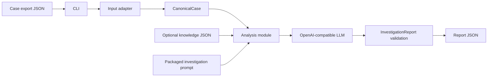
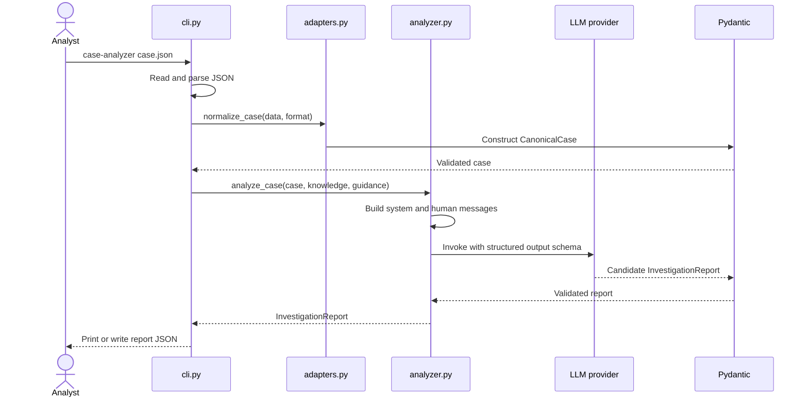
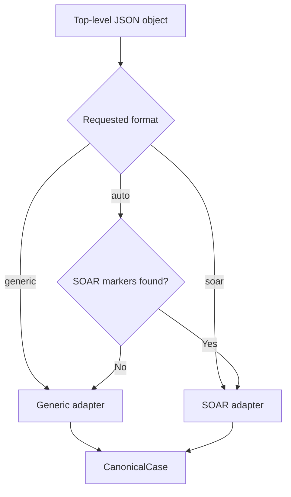
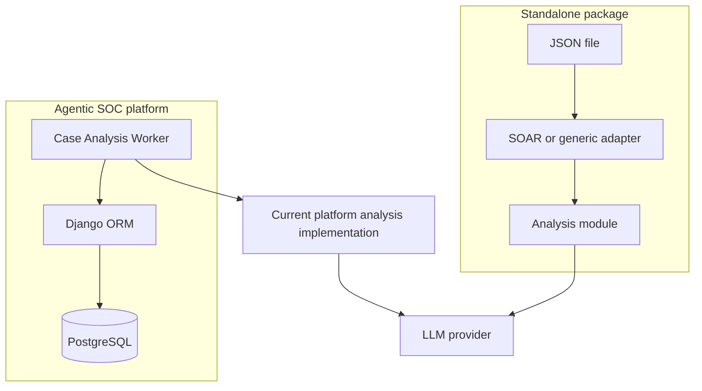

# Case Analyzer code walkthrough

This document explains how the standalone [`case-analyzer`](README.md) package turns a security case exported as JSON into a structured LLM investigation report. The package is intentionally independent from Django: it neither reads the Agentic SOC database nor updates a Case or worker job.

## Design goal

The package has one main interface:

```python
report = analyze_case(canonical_case, knowledge_records=[], user_input="")
```

A caller supplies a validated `CanonicalCase`; the module returns a validated `InvestigationReport`. File reading, source-format normalization, model configuration, prompt construction, and output writing are hidden behind small interfaces.



## Package layout

```text
soc-analyst/
├── pyproject.toml
├── uv.lock
├── examples/
│   ├── generic-case.json
│   └── other-soar-case.json
└── src/case_analyzer/
    ├── __init__.py
    ├── adapters.py
    ├── analyzer.py
    ├── cli.py
    ├── schemas.py
    └── prompts/
        ├── __init__.py
        └── investigation.md
```

The modules have separate responsibilities:

| Module | Responsibility | Knows about |
| --- | --- | --- |
| `cli.py` | Parse arguments, read and write files, select dry-run or invocation | Filesystem and command-line options |
| `adapters.py` | Translate source JSON into one canonical representation | Common generic and SOAR export fields |
| `schemas.py` | Define and validate input and output structures | Pydantic field requirements |
| `analyzer.py` | Build messages, configure the model, invoke it, and return a report | LangChain and OpenAI-compatible providers |
| `prompts/investigation.md` | Tell the model how to reason about evidence | SOC investigation rules |

## End-to-end execution

The command entry point is declared in `pyproject.toml`:

```toml
[project.scripts]
case-analyzer = "case_analyzer.cli:main"
```

Consequently, `uv run case-analyzer ...` calls `main()` in `cli.py`.



### Step 1: read the input

`_json_file()` reads UTF-8 text and calls `json.loads()`. It converts filesystem and JSON parsing failures into a `ValueError` with the affected path. The top-level value is checked by `normalize_case()` and must be a JSON object, not an array or scalar.

An optional `--knowledge` file is read the same way but must contain a JSON array. Its records are passed to the model as supplementary context; the standalone package does not search a database or generate knowledge-search keywords.

### Step 2: select an adapter

`normalize_case(data, source_format)` is the normalization seam. It returns the same `CanonicalCase` type regardless of the source platform.



Automatic detection selects `soar` when the platform/source name contains `soar`, or when the export contains common keys such as `container_type`, `container_status`, `observables`, or `detections`. Otherwise it selects `generic`. Explicit `--format` is safer when an export does not contain recognizable markers.

The helper `_first()` implements field aliases. For example, a SOAR case identifier may be found under `case_id`, `caseId`, `container_id`, or `id`. `_list()` normalizes a missing value to an empty list and a single value to a one-item list.

The initial SOAR mapping is:

| Canonical field | Recognized source fields |
| --- | --- |
| `case_id` | `case_id`, `caseId`, `container_id`, `id` |
| `title` | `title`, `name`, `case_name` |
| `description` | `description`, `data`, `summary` |
| `severity` | `severity`, `priority` |
| `status` | `container_status`, `status` |
| `created_at` | `create_time`, `start_time`, `created_at` |
| `updated_at` | `update_time`, `end_time`, `updated_at` |
| `alerts` | `alerts`, `events`, `detections` |
| `artifacts` | `artifacts`, `observables`, `indicators`, `entities` |
| `comments` | `comments`, `notes` |
| `timeline` | `timeline`, `actions`, `activities` |

This mapping is deliberately conservative. Most nested objects remain dictionaries because SOAR platforms represent evidence differently. Crucially, the adapter also copies the complete input into `source_data`. The LLM can therefore inspect a field that has not yet received a canonical mapping.

`source_data` improves compatibility, but it also means the entire export is sent to the configured model. Sensitive or unnecessary fields should be removed before invocation.

### Step 3: validate the canonical case

`CanonicalCase` is a Pydantic model. It requires `case_id` and `title`; textual metadata defaults to empty strings, and evidence collections default to empty lists. `extra="allow"` permits a caller to add useful canonical fields without modifying the model immediately.

The canonical structure prevents prompt-building logic from depending on source-specific field names:

```json
{
  "case_id": "SOAR-EXAMPLE-001",
  "title": "Suspicious privileged login",
  "severity": "high",
  "alerts": [],
  "artifacts": [],
  "comments": [],
  "timeline": [],
  "source": "Other SOAR Platform",
  "source_data": {}
}
```

### Step 4: build the analysis payload

`build_analysis_payload()` converts the Pydantic case to a plain dictionary and creates the human-message payload:

```json
{
  "case": {},
  "knowledge": {
    "records": []
  },
  "user_input": "Optional analyst guidance"
}
```

`user_input` is omitted when it is empty. `knowledge.records` is always present, even when no knowledge was supplied. This gives the prompt a predictable structure.

`build_analysis_messages()` then creates two LangChain messages:

1. `SystemMessage` contains the packaged `investigation.md` instructions.
2. `HumanMessage` contains the payload serialized as JSON.

The prompt is loaded with `importlib.resources`, so it continues to work after the package is installed as a wheel. It instructs the model to use evidence only, separate facts from inference, deduplicate alerts, list uncertainties, and avoid inventing content merely to fill the schema.

#### Message construction and analyst guidance

`SystemMessage` and `HumanMessage` are LangChain representations of the system and
user roles accepted by chat-model APIs. They have distinct responsibilities:

| Input | Source | Purpose | How to update it |
| --- | --- | --- | --- |
| `SystemMessage` | `src/case_analyzer/prompts/investigation.md` | Stable instructions that define the model's SOC role and investigation rules | Edit the Markdown prompt |
| `HumanMessage.case` | The input export after `normalize_case()` | Evidence for the current investigation, including the original export in `source_data` | Change the export or adapter |
| `HumanMessage.knowledge.records` | The optional `--knowledge` JSON file | Supplementary records relevant to the case | Supply or update the knowledge file |
| `HumanMessage.user_input` | The optional `--user-input` argument | Case-specific analyst emphasis or questions | Change the CLI argument |

The system prompt is loaded by `_system_prompt()` in `analyzer.py`. The
`build_analysis_payload()` function constructs the per-run dictionary, and
`build_analysis_messages()` serializes that dictionary as JSON and wraps both values:

```python
return [
    SystemMessage(content=_system_prompt()),
    HumanMessage(content=json.dumps(payload, ensure_ascii=False)),
]
```

For example, this adds a targeted analyst instruction:

```bash
uv run case-analyzer examples/splunk-soar.json \
  --format soar \
  --user-input "Focus on lateral movement and identify missing evidence"
```

The resulting human-message payload includes:

```json
{
  "case": { "case_id": "...", "source_data": {} },
  "knowledge": { "records": [] },
  "user_input": "Focus on lateral movement and identify missing evidence"
}
```

`user_input` is optional and omitted when empty. It is guidance, not additional
evidence: the system prompt still requires conclusions to be supported by the case or
knowledge records. Broad behavior shared by every investigation belongs in
`investigation.md`; a question or emphasis for one case belongs in `--user-input`.

The walkthrough command prints both messages before invocation. Omit `--invoke` to
inspect them without making an LLM request:

```bash
uv run explain_case_analysis examples/splunk-soar.json --format soar
```

The pretty-printed `HumanMessage (JSON)` in that walkthrough contains the same data
sent to the model, although the actual message is serialized as compact JSON.

### Step 5: configure and invoke the model

`analyze_case()` resolves configuration in this order:

| Setting | First choice | Second choice | Third choice |
| --- | --- | --- | --- |
| Model | `--model` or function argument | `CASE_ANALYZER_MODEL` | `OPENAI_MODEL` |
| Endpoint | `--base-url` or function argument | `CASE_ANALYZER_BASE_URL` | `OPENAI_BASE_URL` |
| Key | `--api-key` or function argument | `CASE_ANALYZER_API_KEY` | `OPENAI_API_KEY` |

The model name is mandatory. The endpoint is optional for the default OpenAI endpoint. In normal use, credentials should be supplied through environment variables instead of command history.

The function constructs `ChatOpenAI` with temperature zero and then calls:

```python
structured_llm = llm.with_structured_output(InvestigationReport)
report = structured_llm.invoke(messages)
```

LangChain supplies the `InvestigationReport` structure to the compatible model and converts the response into the Pydantic model. This is more reliable than asking for arbitrary JSON and manually interpreting it afterward.

### Step 6: validate and write the report

`InvestigationReport` requires the main judgment fields: verdict, severity, impact, priority, confidence, and digest. Its evidence, attack-chain, timeline, IOC, remediation, asset, and unknown collections default to empty lists.

Nested Pydantic models validate the fields within each list. For example, every IOC requires `indicator_type`, `value`, and `context`. A malformed structured response fails validation instead of silently producing a partial report.

The CLI calls `model_dump()`, formats the result as indented JSON, and either prints it or writes it to `--output`. It never changes the input export or sends results back to the originating SOAR platform.

## Dry-run path

`--dry-run` stops before model configuration and invocation:


Use it to confirm field mapping and inspect exactly which case and knowledge data would be included. A dry-run does not load credentials and does not send data over the network.

```bash
cd soc-analyst
uv run case-analyzer examples/other-soar-case.json \
  --format soar \
  --dry-run
```

## Error behavior

The CLI reports these expected input/configuration problems with exit code `2`:

- unreadable input or knowledge files;
- malformed JSON;
- a non-object case export;
- a non-array knowledge file;
- an unsupported format;
- missing model configuration.

Provider connection failures and structured-response failures currently propagate with their underlying exception and traceback. That is useful during this educational stage because it preserves diagnostic detail. A production wrapper may catch, classify, log, and retry those errors according to its own operational policy.

## Independence from the Django worker

The standalone analyzer does not import from `backend/`. It replaces Django Case serialization with file adapters and accepts knowledge as a file rather than querying PostgreSQL.



The production worker has not yet been refactored to import this package. As a result, the two analysis implementations can evolve independently while the standalone input mappings are evaluated. A later integration can make the Django serializer another adapter and call the same analysis interface.

## Extending the analyzer

### Add support for another export shape

Prefer extending the neutral `_soar()` aliases when the new platform uses semantically equivalent fields. Add a separate adapter only when its representation or normalization rules are materially different. Every adapter must return `CanonicalCase`; the analyzer and report schema should not need to change.

After changing a mapping, first run:

```bash
uv run case-analyzer sanitized-export.json --format soar --dry-run
```

Review the canonical fields and `source_data` before making an LLM call.

### Call the module from Python

The CLI is only one caller. Python code can use the package directly:

```python
import json

from case_analyzer import analyze_case
from case_analyzer.adapters import normalize_case

with open("case.json", encoding="utf-8") as source:
    case = normalize_case(json.load(source), "soar")

report = analyze_case(case)
print(report.model_dump_json(indent=2))
```

This interface makes it possible to add an HTTP endpoint, queue consumer, notebook, or another worker without putting those concerns inside the analysis module.
